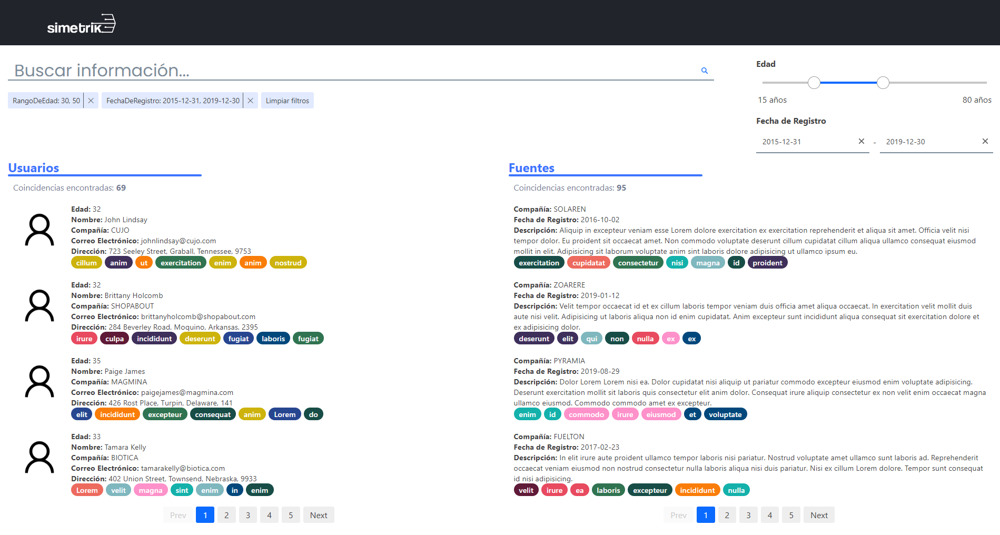
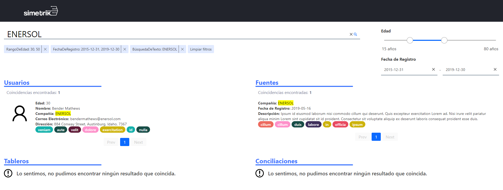
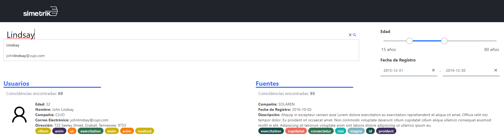
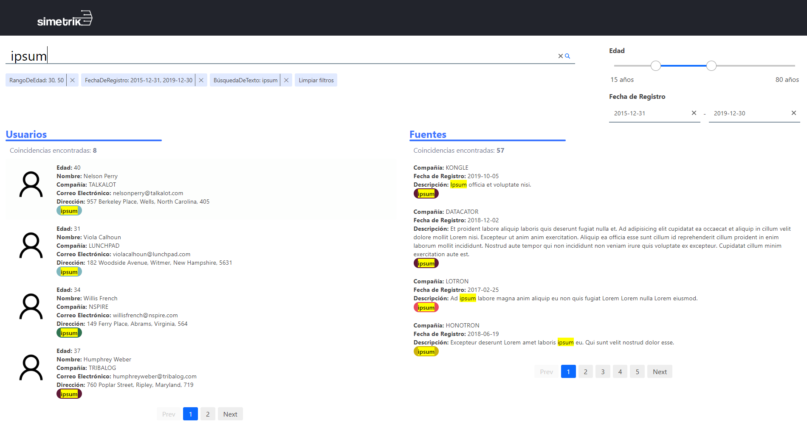

# Advanced Search

Search box to filter multiple data sets by type and content, developed with ReactJs and Elastic Search.

<div style='background:#22242c; text-align:center; padding: 10px; width: 200px; margin: 0 auto;'>
  
</div>


### 🚀 Links

 * **Website:** https://williamvelazquez.github.io/advanced-search/


### 🔧 Installation

Require Node.JS
```
npm install
```

Create a **.env** file at root level following the example file (.env-example).
```
PORT=3001
NODE_ENV=development
CLUSTER_URL='https://...'
CREDENTIALS='XxXxXxX:XxXxXxXXxXxXxX'
APPS=users,sources,boards,reconciliations
```
>This project needs credentials for a **appbase.io** cluster for the Elastic Search Queries, feel free to can contact me to get them.


### 🛠️ Execution

📌 **Development Environment**
```
npm run dev
```

>This project runs on **http://localhost:3001** or the specified **PORT** on the .env file.


📌 **Production Environment**

Run the following command to create the production build over the **dist** folder:
```
npm run prod
```

>After creating the production build you can open the **index.html** on your browser.

📌**Testing**

Require Jest
```
npm run test
```
>The previous command will run all the tests over the folder **\_\_tests\_\_**.

Generate Tests Coverage Report
```
npm run test:coverage
```
>You can find a visual report over the folder: **coverage/lcov-report/index.html** that you can open on your favorite browser.


📌**Deployment on GitHub Pages**

Run the following command to create the production build and deploy on gh-pages branch for the first time:
```
npm run deploy:new
```
>For running the command you should add the following directories to **PATH**:
>- **C:\Program Files\Git\usr\bin**
>- **C:\Program Files\Git\mingw64\libexec\git-core**

Run the following command to create the production build and deploy if you already have the gh-pages branch:
```
npm run deploy
```


### 💻 Technologies

  * Jest
  * React
  * ESLint
  * Webpack
  * Elastic Search
  * Styled Components


### 📝 Questions

1. **¿Por qué no debería usar la librería JQuery, si estoy usando ReactJS?**

JQuery es una biblioteca/dependencia pesada (por lo tanto hace lenta la carga de nuestro sitio) que no deberíamos necesitar si ya estamos utilizando React que es otra biblioteca enfocada en la creación de interfaces de usuario, además en la actualidad la mayoría de problemas que solucionaba JQuery son facilmente manejados con Javascript Vanilla (lo cual es más óptimo y no dependes de una un tercero para dichas tareas).

2. **¿Porque usarias Hooks de las nuevas versiones de ReactJS, en lugar de class component?**

Los hooks al ser funciones nativas del lenguaje son más eficientes en rendimiento que las clases (que son una abstracción), además de encapsular funcionalidades recurrentes facilitan la lectura de código. Aunque es bueno saber ambos debido a que los Hooks aún realizan el 100% de las cosas que se pueden hacer con clases.

3. **¿Que es un archivo JSX?**

Es una sintáxis de etiquetas similar a HTML para trabajar templates y componentes en Javascript extendiendo sus capacidades y agilizar su desarrollo.

4. **¿Que diferencia hay entre una function y una arrow function de Javascript?**

Las funciones principalmente modifican el contexto de la palabra reservada *this*, tienen hoisting y son redeclarables(al ser nombradas y no anónimas como en el caso de las arrow), cuando no es de igual forma con las arrow functions, que por su lado tienen una sintáxis más amigable y corta (ya que puedes evitar/ahorrarte el uso de algunos paréntesis y las llaves).

5. **¿Qué es Redux y cómo nos ayuda en los proyectos?**

Es una biblioteca para el manejo/gestión del estado global de una aplicación el cual está basado en la arquitectura Flux (en donde el flujo de datos es unidireccional), lo que nos ayuda a manejar de forma eficiente el flujo de una aplicación grande haciendo predecibles los cambios del estado y teniendo una única fuente de la verdad(store).

6. **¿Por qué usuarías pruebas unitarias en tu código?**

Usaría las pruebas para mejorar la calidad de mi código, reducir tiempos de depuración y corrección sobre el mismo, por otro lado proporciona confianza al realizar cambios y reduce el tiempo al integrar con otros componentes de Software. Además de lo anterior, le dan contexto y claridad de lo que hace el código a cualquiera que lo revise (autodocumentación) y finalmente puedo probar una pequeña parte de lo desarrollado sin el software completo.

7. **¿Que nos permite hacer la siguiente declaración?**

```js
const anyFunction = (param_1) => (param_2) => param_1 + param_2
```

Una función currificada nos permite llamar a una función con menos parámetros de los que espera y devolver una función que espera los parámetros restantes para al final dar el resultado.

La declaración anterior sería equivalente a la siguiente:

``` js
const anyFunction = function (param_1) {
  return function (param_2) {
    return param_1 + param_2;
  }
}
```

Al componer funciones con el currying es más simple crear nuevas funciones pasando la función base con algún valor( como **sumar(3)(2)** donde se podría aislar la primera parte como **const sumar3 = sumar(3)**). 


### ✒️ Author

* **William Velazquez** - [Website](https://williamvelazquez.com/)

If you want to know about the insights [click here!](https://github.com/WilliamVelazquez/advanced-search/pulse/monthly)


### 📷 Screenshots







## 📄License

This project is licensed under the terms of the **MIT license**.


### 🎁 Contribute

Feel free to contribute to the project!
